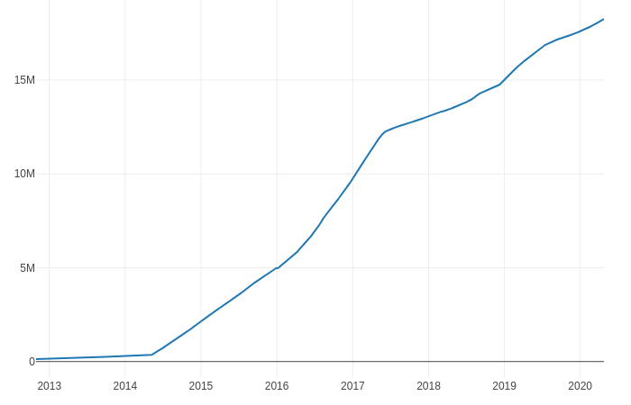
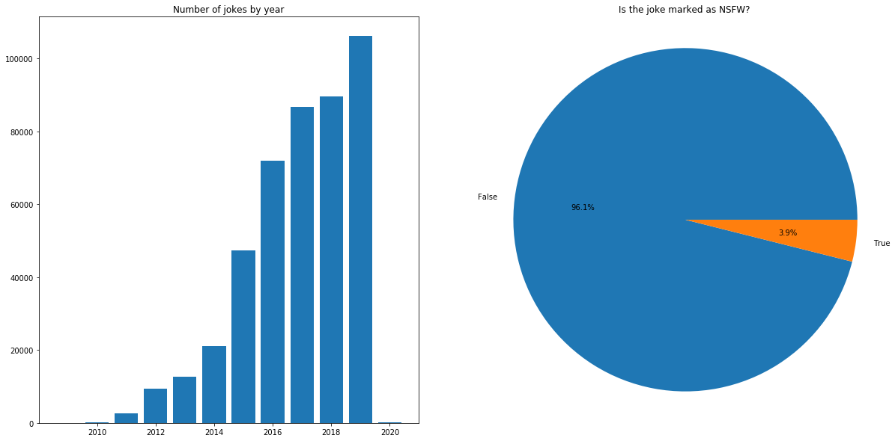
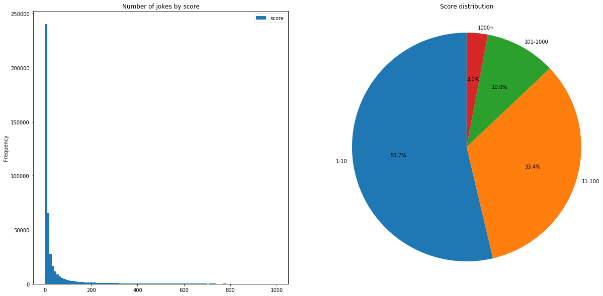
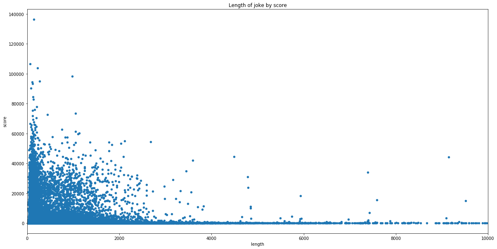
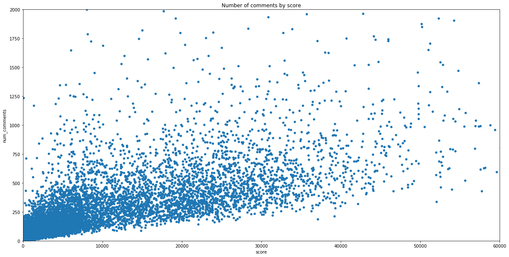

# Analysis of r/Jokes

## Introduction

First and foremost, why [r/Jokes](https://reddit.com/r/jokes)? It struck me while browsing Reddit that this _should_ be a goldmine for text analysis. Thousands of posts, each scored and judged by objective redditors.

There must be an API to download all this data. Two searches and I find [PRAW: The Python Reddit API Wrapper](https://praw.readthedocs.io/en/latest/). OK, let's set this up - look at some tutorials, use your Reddit to account create an API key to be used in your script...

Now, create a basic script to fetch me the newest 100 posts. Sweet. I need more, though. I need to cycle through id's? How do I do that? Read some more posts. Yeah, it's not going to work like this.

[Pushshift](https://pushshift.io/) gets thrown around, which should solve my problems, as it crawls and archives most of Reddit. This API allows me to cycle through posts using timestamps as basic url parameters and so I can download quite a lot of posts. Community, please keep Pushshift running.

I manage to download around 360 000 posts. While analyzing the data, I realize that it isn't quite what I want - as I've read from several sites, Pushshift actually saves the state of the post at the time of crawling. I've found that some posts with a great number of comments got only a score of 1 when they actually have 32k. This makes my analysis inaccurate. I need to go back to PRAW as it will get me real data.

Here comes a lot of frustration. But then I find [this article](https://dvc.org/blog/a-public-reddit-dataset) from Elle O'Brien and DVC. Great stuff, now we're talking.

## Step 1: Get the data

Ellen gives us the [scripts](https://github.com/iterative/aita_dataset) from her process.

One thing to note: I suppose she used this approach because, as many others have realized, parsing with PRAW takes a lot of time. Pushshift makes a great job in simplifying the process. Fetch the id's, and then - since we want fresh data - use PRAW for the actual stuff.

I tweaked the second script to use r/Jokes and I added some other attributes for the posts - in particular, **upvote_ratio**. Let's start the script. It takes a lot of time. Almost two minutes for 1000 posts and it started to grow, but seemed to plateau at 4 minutes for 1000 posts.

This is not right. Did she let the script run that much time? Is it supposed to take this long?. I give in and let it run for the night. Waking up, I see that the process got interrupted at 72 000 due to a network error. It can't be right.

I thought that calling `reddit.submission` was the culprit. Instead, I sought to use `reddit.info` which would allow me to query 100 submissions in one go by giving it a list of id's. The speed is still bad.

I start to debug, timing all the instructions from the script. I found that `upvote_ratio = post.upvote_ratio` took almost **400ms** as opposed to the other operations, such as the `writer` call which rarely exceeded **1ms**. After a search, I found that this makes an extra API call and that results in the overhead. Probably, it would've given an extra edge in analysis, but I had to get rid of the attribute. Now, a speed of 1000 posts in approximately 10 seconds, running it for about 3.5 hours. Out of **1.06 million** post id's from Pushshift, only **447 000** submissions make it through the checks (non-empty, non-deleted title or body). I didn't want my dataset to look like it did last time - almost 75% of posts under a score of 10.

Conclusion: Double check your scraping scripts - might save you and external APIs loads of time and bandwidth.

## Step 2: Data cleanup

Why not do the cleanup along the way in the scraping script? I think it adds a lot of overhead. Get the data first, then play with it after. Don't sabotage your script by making it take more time then necessary in between requests.

Merge the `title` and `body` columns since a lot of jokes use the title as the setup for the punchline. Count length, everything to lowercase and keep only alphanumeric characters. Remove stopwords.

## Step 3: Broad look

Let's start with the evolution of subscribers (thanks to [Subreddit Stats](https://subredditstats.com)) - sitting at 18.3M in May, 2020.



Let's keep this into account.

Now for some stats from our dataset.





And scatterplots.




Top words in top jokes:

```
says, man, said, one, get, wife, like, back, asks, know, well, asked, would, guy, go, day, woman, two, got, old, time, first, edit, see, people, husband, next, going, went, want, goes, girl, replies, home, could, son, told, little, take, door, replied, good, new, doctor, boy, really, right, oh, father, dad
```

And about dirty jokes...


### **Conclusions**

As we can see, a shorter, dirty joke will bring a bigger score.
A bigger score means more comments.

## Step 4: Classifying

### **Vectorization**

The text analysis approach to feature encoding is vectorization. I used both Count Vectorization (one-hot encoding with apparition count) and TF - IDF Vectorization (using n-grams instead of one-hot encoding).

```python
from sklearn.feature_extraction.text import TfidfVectorizer

# This vectorizer breaks text into single words and bi-grams
# and then calculates the TF-IDF representation
tf_vectorizer = TfidfVectorizer(ngram_range=(1,2))

from sklearn.feature_extraction.text import CountVectorizer
# Fit the CountVectorizer to the training data
c_vectorizer = CountVectorizer()

# the 'fit' builds up the vocabulary from all the reviews
# while the 'transform' step turns each indivdual text into
# a matrix of numbers.
vectors = tf_vectorizer.fit_transform(cldf['text'].values)
#vectors = c_vectorizer.fit_transform(cldf['text'].values)
```

### **Initial try**

Tried doing a LinearSVC on the whole dataset only to fail miserably. I realized that the model's fitting on the dataset is way too large for my computer's memory.

Next, I extracted only a sample of the dataset (25 000 rows) and obtained an accuracy of 0.08 - horrible. The approach clearly didn't work due to the great variation in scores.

### **Mapping**

Then, I thought about mapping these large scores into 3 sections:

- average jokes (0) - scores smaller than 5
- good jokes (1) - from the remaining, scores smaller than 100
- great jokes (2) - everything else

As expected, great jokes were smaller in numbers. But now I wanted to have an even number of jokes by the new **mark** column.

```python
cldf = df[df['mark'] == 2]
category_size = cldf.shape[0]

cldf = pd.concat([cldf, df[df['mark'] == 0].sample(category_size), df[df['mark'] == 1].sample(category_size)])
```

### **Training**

```python
from sklearn.svm import LinearSVC
# initialise the SVM classifier
classifier = LinearSVC(max_iter=1500)

# train the classifier
classifier.fit(X_train, y_train)

from sklearn.metrics import accuracy_score
preds = classifier.predict(X_test)
print(accuracy_score(y_test, preds))
```

```python
from sklearn.linear_model import LogisticRegression,SGDClassifier
model = LogisticRegression(max_iter=500)
model.fit(X_train, y_train)

from sklearn.metrics import accuracy_score
predictions = model.predict(X_test)

print(accuracy_score(y_test, predictions))
```

I didn't have any expectations at this point. An accuracy of 0.47 seemed OK. (Logistic Regression performed a tiny bit better than LinearSVC - by 0.008)

```python
from sklearn.metrics import confusion_matrix

print(confusion_matrix(y_test, predictions))

[[8269 3751 2424]
 [5868 4291 4397]
 [2669 3102 8627]]
```

The confusion matrix shows us that the good jokes (those in the middle) are confused with the others quite a lot of time. So that's why I gave in and went on to analyze only two categories: good jokes (1) and bad jokes (0). I maintained the same marking logic - but I removed the data in the middle.

I added also the Naive-Bayes Bernoulli - just to see what happens.

We reached a score of **0.740** with the LinearSVC, Logistical Regression performing slightly worse, at **0.728**. Bernoulli is way worse, at **0.618**.

### **More features?**

But we still have the **length** and **nsfw** features? Shouldn't we use them?

Yes, we should. Map those accordingly and add them to the training.

```python
from sklearn.model_selection import train_test_split
X_text_train, X_text_test, y_train, y_test = train_test_split(vectors, cldf['mark'].values, test_size=0.2, random_state=42)
X_nsfw_train, X_nsfw_test, y_train, y_test = train_test_split(cldf['nsfw'].values, cldf['mark'].values, test_size=0.2, random_state=42)
X_length_train, X_length_test, y_train, y_test = train_test_split(cldf['length'].values, cldf['mark'].values, test_size=0.2, random_state=42)

from scipy.sparse import hstack
X_train = hstack((X_text_train, X_nsfw_train[:, None], X_length_train[:, None]))
X_test = hstack((X_text_test, X_nsfw_test[:, None], X_length_test[:, None]))
```

Scores? Only **0.742**.

### **Joke evaluator**

```python
def is_this_good(joke_text, joke_nsfw):
    joke_text = clean_text(joke_text)
    joke_length = len(joke_text)
    joke_text = tf_vectorizer.transform([joke_text])
    jinput = hstack((joke_text, joke_nsfw, joke_length))

    pred = classifier.predict(jinput)

    if pred == 0:
        return 'Bad joke!'
    else:
        return 'Good joke!'
```

### **Joke scorer revisited**

Looked again at our first classifier:

Modifying the classifier to train only on the rows with a score of less than 100 is actually possible. It trained on about 390 000 rows. The accuracy is a staggering **0.09**. If we overlook that score is off by 10, then accuracy increases to **0.61**.

## Technical Conclusions

Let me reiterate through these:

- Think about the others: those that provide you with data, and those that are scraping, just like you;
- Watch your scraping scripts - check them both for speed and for data;
- Analyze your data carefully;
- Fine-tune your classifier;
- Try out more algorithms.
- Retry and retry.

## Last words

I'd like to thank again these guys:

- [Ellen O'Brien and DVC](https://dvc.org/blog/a-public-reddit-dataset)
- [Gareth Dwyer and DevelopIntelligence](https://www.developintelligence.com/blog/2017/03/predicting-yelp-star-ratings-review-text-python/)
